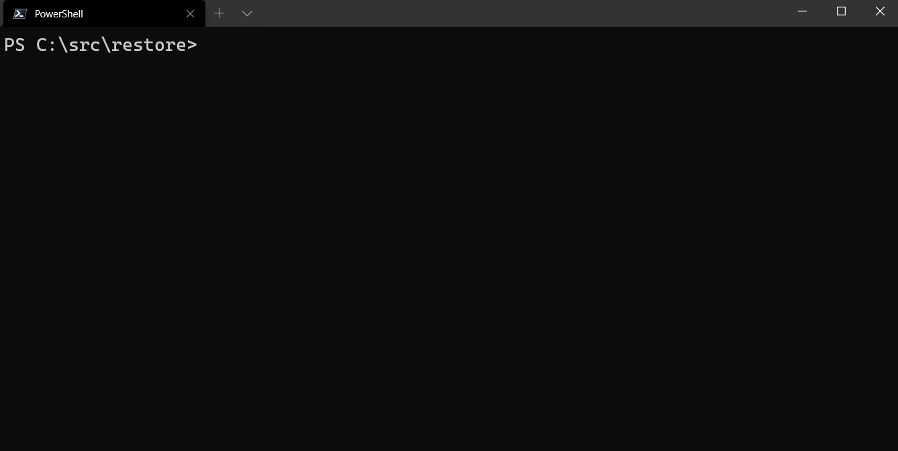

# Restore

Restore saves the state of your terminal so you can restore it the next time you open one. 



## Disclaimer

This is probably not a great idea. Every time you execute a command, this module serializes your location, variables and loaded modules to a CLIXML file. 

## How to use

Install the module. 

```
Install-Module Restore
```

Add it to your profile.

```
Import-Module Restore
```

Restore terminals that you closed previously.

```
Restore-Terminal
```

After restoring a terminal, the following will be restored.

- Location
- Variables
- Modules

## How it works

If you want to use this module, load it into your PowerShell profile. 

```
Import-Module Restore
```

When you import the module, it assigns an event handler to the `AvailabilityChanged` event of the main runspace. 

```
$Host.Runspace.add_AvailabilityChanged({Checkpoint-Terminal})
```

Every time the runspace changes state (like when it completes running a command), it will call `Checkpoint-Terminal`. This will create a hashtable with your session state, serialize it to CLIXML and save it to disk. 

```
$state = @{
    Location = (Get-Location).ToString()
    Variables = Get-Variable -Scope "Global" | ForEach-Object { [PSCustomObject]@{ Name = $_.Name; Value = $_.Value } }
    Modules = Get-Module | ForEach-Object { [PSCustomObject]@{ Name = $_.Name; Path = $_.Path } }
}

Start-Job -ScriptBlock {
    $args[0]  | Export-Clixml -Path "$Env:AppData\restore.$pid.clixml"
} -ArgumentList $state
```

If you close a terminal that you didn't mean to close, you can call `Restore-Terminal` in a new PowerShell window to load up the terminal state. Kinda like `Ctrl+Shift+T` in a browser. 